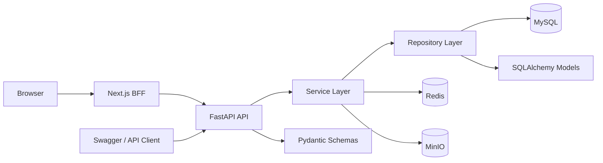

# Leo Agent Platform

Leo Agent Platform is a full-stack foundation for building and operating AI agent products. The backend uses FastAPI with asynchronous SQLAlchemy, MySQL, Redis, JWT authentication, and modular business services. The administration console uses Next.js App Router and a same-origin BFF so access tokens remain in secure, HttpOnly cookies.

The repository currently provides authentication and RBAC, model provider and model management, versioned prompt management, authenticated tool management, MinIO-backed knowledge-base ingestion and retrieval, and an authenticated Agent runtime with versioned aggregate configuration.

## Current Implementation

### Backend

- Asynchronous FastAPI APIs with a consistent response envelope
- MySQL 8.4 persistence through SQLAlchemy 2.0 and `asyncmy`
- Alembic migrations for application tables
- Redis-backed image CAPTCHA and permission caching
- bcrypt password hashing and JWT authentication
- User, role, and permission CRUD with paginated search
- User-role and role-permission assignment with cache invalidation
- Model provider CRUD with encrypted API keys and live connection testing
- Model CRUD with provider filtering and foreign-key validation
- Prompt CRUD with draft, publish, version history, and rollback workflows
- Tool CRUD, state transitions, and real HTTP API connection testing
- Knowledge-base CRUD, MinIO document upload/download, durable delete cleanup, background parsing, configurable chunking, segment administration, retry, and lexical retrieval testing
- TXT, Markdown, CSV, HTML, DOCX, and text-based PDF ingestion with document and knowledge-base status tracking
- Agent CRUD with typed model, prompt, RAG, tool, and advanced configuration
- Agent draft/publish/start/stop/error lifecycle with immutable version snapshots
- Agent rollback, aggregate reference validation, real provider invocation, and seven-day runtime metrics
- Request logging, application lifecycle handling, and business exception mapping
- Automated backend tests with pytest and pytest-asyncio

### Administration Console

- Next.js 16 App Router, React 19, and strict TypeScript
- Login with image CAPTCHA and an HttpOnly cookie session
- Protected dashboard and same-origin BFF route allowlist
- User, role, permission, provider, model, prompt, tool, and Agent management pages
- Provider connection tests and masked API-key handling
- Prompt publishing, version history, and rollback interactions
- Tool registration, JSON configuration, state transitions, and live execution tests
- Agent aggregate configuration, version history, rollback, lifecycle control, and live invocation
- TanStack Query for remote state and cache invalidation
- Zustand for client-only UI state
- React Hook Form and Zod for form and API-boundary validation
- shadcn/ui and Tailwind CSS 4 for the component system
- Vitest contract and component tests

For the detailed delivery snapshot, see [Implementation Summary](docs/IMPLEMENTATION_SUMMARY.md). The product and architecture specification is in [Project Specification](docs/PROJECT_SPEC.md), and the checked-in API contract is in [OpenAPI JSON](docs/openai.json).

## Technology Stack

| Area | Technology |
| --- | --- |
| Backend | Python 3.13, FastAPI, Uvicorn |
| Validation | Pydantic, pydantic-settings |
| Database | MySQL 8.4, SQLAlchemy 2.0, asyncmy |
| Migrations | Alembic |
| Cache | Redis |
| Security | PyJWT, bcrypt, Fernet, image CAPTCHA |
| Object storage | MinIO |
| Document parsing | pypdf, python-docx, and standard-library text parsers |
| Backend tests | pytest, pytest-asyncio, HTTPX |
| Frontend | Next.js 16, React 19, TypeScript |
| UI | shadcn/ui, Tailwind CSS 4 |
| Frontend state | TanStack Query, Zustand |
| Forms and validation | React Hook Form, Zod |
| Frontend tests | Vitest, Testing Library |

## Architecture

The backend is organized by business module. HTTP handling, business rules, and data access remain isolated, and all database and cache I/O is asynchronous.



### Layer Responsibilities

| Layer | Location | Responsibility |
| --- | --- | --- |
| API | `src/modules/*/api.py` | Routes, dependencies, request parameters, and response models |
| Schema | `src/modules/*/schema.py` | Pydantic request and response contracts |
| Service | `src/modules/*/service.py` | Business validation, orchestration, and cache invalidation |
| Repository | `src/modules/*/repository.py` | SQLAlchemy queries and persistence |
| Model | `src/modules/*/model.py` | Database tables and ORM relationships |
| Core | `src/core/` | Configuration, dependencies, base classes, responses, and exceptions |
| Infrastructure | `src/infra/` | Database, Redis, and MinIO clients |
| BFF | `app/src/app/api/` | Session handling and allowlisted backend forwarding |

## Repository Layout

```text
.
├── alembic/                    # Alembic environment and migrations
├── app/                        # Next.js administration console
├── docs/
│   ├── IMPLEMENTATION_SUMMARY.md
│   ├── PROJECT_SPEC.md
│   └── openai.json             # OpenAPI contract snapshot
├── docker/
│   ├── docker-compose.yaml     # MySQL, Redis, and MinIO
│   └── .env.example
├── src/
│   ├── core/
│   ├── infra/
│   ├── middlewares/
│   ├── modules/
│   │   ├── auth/
│   │   ├── agent/
│   │   ├── captcha/
│   │   ├── KnowledgeBase/
│   │   ├── model/
│   │   ├── permission/
│   │   ├── prompt/
│   │   ├── provider/
│   │   ├── role/
│   │   ├── tool/
│   │   └── user/
│   ├── utils/
│   └── main.py
├── test/                       # Backend automated tests
├── .env.example
├── alembic.ini
├── requirements.txt
└── test_api.http
```

## Business Modules

| Module | Available capabilities |
| --- | --- |
| User | Create, paginated search, detail, current user, role assignment |
| Captcha | Base64 image CAPTCHA stored temporarily in Redis and consumed once |
| Auth | CAPTCHA and password validation, login timestamp, JWT issue and logout |
| Permission | CRUD, paginated search, and permission-code lookup |
| Role | CRUD, paginated search, permission assignment, user-role relationships |
| Provider | Authenticated CRUD, encrypted API keys, masked responses, live connection tests |
| Model | Authenticated CRUD, provider relationship, provider filter, capabilities and pricing |
| Prompt | Authenticated CRUD, draft state, semantic versions, immutable snapshots, rollback |
| Tool | Authenticated CRUD, enabled/disabled/error lifecycle, HTTP execution tests |
| KnowledgeBase | Authenticated CRUD, MinIO upload/download, background parsing and chunking, document retry, segment management, and lexical retrieval tests |
| Agent | Authenticated CRUD, aggregate validation, publishing, version history, rollback, lifecycle control, provider invocation, and runtime metrics |

## Prompt Lifecycle

Prompts use an explicit draft and version workflow:

```text
Create draft
  -> first publish creates v1.0
  -> edit published prompt creates unpublished changes
  -> publish again creates v1.1
  -> rollback restores a selected snapshot
```

Published versions retain independent snapshots of prompt content, variables, metadata, author, changelog, and publication time.

## Agent Lifecycle

Agents are created as unpublished drafts. Publishing validates every referenced model, provider, prompt, knowledge base, and tool before creating an immutable full-configuration snapshot.

```text
Create -> draft
draft/inactive -> publish -> inactive
inactive/error -> start -> active
active/error -> stop -> inactive
active -> runtime failure -> error
draft/inactive -> rollback -> inactive at the selected snapshot
```

The first publication is `v1.0`; later publications increment the minor version without deleting history. An Agent can only accept `/invoke` requests while active. The runtime currently supports OpenAI-compatible and Anthropic message APIs, forwards enabled function definitions to the model, records invocation results, and exposes rolling seven-day call and success metrics.

## Local Development

Run backend commands from the repository root so Pydantic Settings can load the root `.env` file:

```bash
cd /Users/leo/leo-agent-app/leo-agent-platform
```

The application resolves the root `.env` from the source tree, so PyCharm and Uvicorn use the same configuration regardless of their working directory. Explicit process environment variables still take precedence; do not define an empty `DB_PASSWORD` override.

### 1. Prepare Python

The development environment uses Python 3.13:

```bash
conda create -n leo python=3.13
conda activate leo
python -m pip install -r requirements.txt
```

If the environment already exists:

```bash
conda activate leo
python -m pip install -r requirements.txt
```

### 2. Configure Environment Variables

Copy the application and Docker templates:

```bash
cp .env.example .env
cp docker/.env.example docker/.env
```

Keep these values synchronized:

| Application `.env` | Docker `docker/.env` | Purpose |
| --- | --- | --- |
| `DB_PASSWORD` | `MYSQL_ROOT_PASSWORD` | MySQL root password |
| `DB_NAME` | `MYSQL_DATABASE` | Database name |
| `REDIS_PASSWORD` | `REDIS_PASSWORD` | Redis password |
| `MINIO_ACCESS_KEY` | `MINIO_ROOT_USER` | MinIO access key |
| `MINIO_SECRET_KEY` | `MINIO_ROOT_PASSWORD` | MinIO secret key |

For a backend process running on the host:

```dotenv
DB_HOST=127.0.0.1
DB_PORT=3306
REDIS_HOST=127.0.0.1
REDIS_PORT=6379
```

Provider API keys use a dedicated Fernet encryption key. Generate one before the first start:

```bash
python -c "from cryptography.fernet import Fernet; print(Fernet.generate_key().decode())"
```

Add it to `.env`:

```dotenv
PROVIDER_ENCRYPTION_KEY=<generated-fernet-key>
PROVIDER_CONNECT_TIMEOUT_SECONDS=10
```

Existing provider API keys cannot be decrypted if this key is lost. Back it up in a production secret manager. Never commit the real `.env` file, tokens, or credentials.

### 3. Start Infrastructure

Start Docker Desktop, then run:

```bash
docker compose --env-file docker/.env \
  -f docker/docker-compose.yaml \
  up -d
```

Inspect the services:

```bash
docker compose --env-file docker/.env \
  -f docker/docker-compose.yaml \
  ps
```

Default endpoints:

| Service | Address |
| --- | --- |
| MySQL | `127.0.0.1:3306` |
| Redis | `127.0.0.1:6379` |
| MinIO API | `http://127.0.0.1:9000` |
| MinIO Console | `http://127.0.0.1:9001` |

### 4. Apply Database Migrations

```bash
alembic upgrade head
```

Inspect the current revision and migration heads:

```bash
alembic current
alembic heads
```

After changing an ORM model:

```bash
alembic revision --autogenerate -m "describe_change"
alembic upgrade head
```

Always review autogenerated migrations before committing them.

### 5. Start the Backend

```bash
python -m uvicorn src.main:app \
  --reload \
  --host 127.0.0.1 \
  --port 8000
```

Available development endpoints:

| Page | Address |
| --- | --- |
| Health check | `http://127.0.0.1:8000/health` |
| Swagger UI | `http://127.0.0.1:8000/docs` |
| ReDoc | `http://127.0.0.1:8000/redoc` |
| OpenAPI JSON | `http://127.0.0.1:8000/openapi.json` |

### 6. Start the Administration Console

Keep the backend running and open another terminal:

```bash
cd app
cp .env.example .env.local
pnpm install
pnpm dev
```

Open `http://localhost:3000`. The console connects to `http://127.0.0.1:8000` by default. Next.js stores the JWT in an HttpOnly cookie; browser JavaScript never receives or persists it.

## PyCharm Configuration

Create a Python run configuration under **Run → Edit Configurations**:

| Setting | Value |
| --- | --- |
| Name | `FastAPI` |
| Run | `Module name` |
| Module name | `uvicorn` |
| Parameters | `src.main:app --reload --host 127.0.0.1 --port 8000` |
| Python interpreter | `/opt/miniconda3/envs/leo/bin/python` |
| Working directory | `$PROJECT_DIR$` |
| Environment variables | Leave empty unless intentionally overriding `.env` |

Do not define an empty `DB_PASSWORD=` in PyCharm. Process environment variables take precedence over values loaded from `.env`.

## API Overview

Provider, model, prompt, tool, knowledge-base, and Agent endpoints require a Bearer token. The Next.js console adds it through the BFF. Some legacy user, role, and permission routes still require endpoint-level authorization hardening.

| Resource | Base path | Main operations |
| --- | --- | --- |
| Authentication | `/api/v1/auth` | Login and logout |
| Users | `/api/v1/users` | CRUD, current user, role assignment |
| Roles | `/api/v1/roles` | CRUD and permission assignment |
| Permissions | `/api/v1/permissions` | CRUD and paginated search |
| Providers | `/api/v1/providers` | CRUD and connection test |
| Models | `/api/v1/models` | CRUD and provider filtering |
| Prompts | `/api/v1/prompts` | CRUD, publish, versions, rollback |
| Tools | `/api/v1/tools` | CRUD, enable, disable, and connection test |
| Knowledge bases | `/api/v1/knowledge-bases` | CRUD/config, MinIO upload/download, processing retry, documents, segments, and retrieval tests |
| Agents | `/api/v1/agents` | CRUD, publish, versions, rollback, start, stop, and invoke |

The fixed `/users/me` route must remain registered before `/users/{user_id}` so FastAPI does not attempt to parse `me` as an integer.

## Validation

Run backend checks from the repository root:

```bash
python -m compileall -q src alembic test
alembic check
python -m pytest -q
```

Run frontend checks from `app/`:

```bash
pnpm check
pnpm build
```

Run the final whitespace check from the repository root:

```bash
git diff --check
```

## Configuration Precedence

Pydantic Settings resolves values in this order:

```text
process environment > repository .env > Settings defaults
```

If the application still uses an empty database password:

1. Confirm that Uvicorn's working directory is the repository root.
2. Remove any empty `DB_PASSWORD` override from PyCharm.
3. Restart the application after changing `.env`.
4. Confirm that `DB_PASSWORD` matches Docker's `MYSQL_ROOT_PASSWORD`.

## Development Conventions

Implement new backend modules in this order:

1. Define SQLAlchemy models and add an Alembic migration.
2. Define Pydantic request and response schemas.
3. Implement repository data access.
4. Implement service-level business rules.
5. Add API routes and register the router in `src/main.py`.
6. Add automated tests and update the OpenAPI snapshot.
7. Add the frontend schema, BFF allowlist, query functions, UI, and tests.

Keep API handlers small, place business rules in services, and isolate database queries in repositories. Do not commit secrets, tokens, database files, generated logs, or local environment files.

## License

This project is licensed under the [Apache License 2.0](LICENSE).
