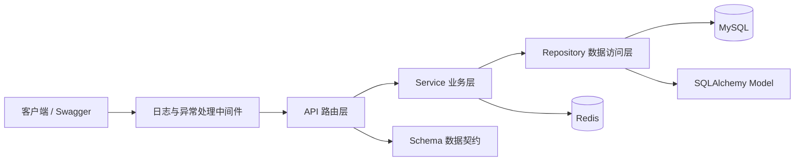

# Leo Agent Platform

Leo Agent Platform 是一个面向智能体平台的异步后端基础工程。项目基于 FastAPI 构建，提供用户、图片验证码、登录认证、JWT 当前用户、权限管理以及角色关联的数据模型，并为后续扩展智能体、知识库、工具和任务编排等业务模块预留清晰的分层结构。

## 功能概览

- 异步 FastAPI API 与统一响应结构
- MySQL 8.4 + SQLAlchemy 2.0 异步数据访问
- Alembic 数据库版本管理
- Redis 图片验证码与一次性校验
- bcrypt 密码哈希
- JWT 登录认证与当前用户接口
- 用户、权限 CRUD
- 用户、角色、权限多对多关系模型
- 请求日志、统一业务异常与应用生命周期管理
- Docker Compose 本地基础设施
- pytest 单元测试

## 技术栈

| 类别 | 技术 |
| --- | --- |
| Web 框架 | FastAPI、Uvicorn |
| 数据校验 | Pydantic、pydantic-settings |
| 数据库 | MySQL 8.4、SQLAlchemy 2.0、asyncmy |
| 数据迁移 | Alembic |
| 缓存 | Redis |
| 认证安全 | PyJWT、bcrypt、图片验证码 |
| 对象存储 | MinIO（Docker 基础设施已提供） |
| 测试 | pytest、pytest-asyncio |

## 架构

项目采用按业务模块组织的分层架构。HTTP 处理、业务规则和数据访问相互隔离，所有数据库和缓存 I/O 均使用异步调用。



### 分层职责

| 层 | 目录/文件 | 职责 |
| --- | --- | --- |
| API | `src/modules/*/api.py` | 声明路由、依赖、请求参数和响应模型 |
| Schema | `src/modules/*/schema.py` | 定义 Pydantic 请求与响应数据结构 |
| Service | `src/modules/*/service.py` | 业务校验、流程编排和异常处理 |
| Repository | `src/modules/*/repository.py` | 封装 SQLAlchemy 查询与持久化操作 |
| Model | `src/modules/*/model.py` | 定义数据库表和 ORM 关系 |
| Core | `src/core/` | 配置、依赖、基础模型、统一响应与异常 |
| Infra | `src/infra/` | 数据库和 Redis 等基础设施连接 |

### 目录结构

```text
.
├── alembic/                    # Alembic 环境与迁移脚本
├── docker/
│   ├── docker-compose.yaml     # MySQL、Redis、MinIO
│   └── .env.example            # Docker 服务配置模板
├── src/
│   ├── core/                   # 配置、依赖、基础类、异常和日志
│   ├── infra/                  # MySQL 与 Redis 连接
│   ├── middlewares/            # HTTP 中间件
│   ├── modules/
│   │   ├── auth/               # 登录和 Token 签发
│   │   ├── captcha/            # 图片验证码
│   │   ├── permission/         # 权限 CRUD
│   │   ├── role/               # 角色及关联模型
│   │   └── user/               # 用户 CRUD 与当前用户
│   ├── utils/                  # JWT 与密码工具
│   └── main.py                 # FastAPI 应用入口
├── test/                       # 自动化测试
├── .env.example                # 应用配置模板
├── alembic.ini
├── requirements.txt
└── test_api.http               # IDE HTTP Client 请求示例
```

## 业务模块

| 模块 | 当前能力 |
| --- | --- |
| User | 创建、列表、详情、当前登录用户；密码使用 bcrypt 哈希保存 |
| Captcha | 生成 Base64 图片验证码，在 Redis 中限时保存并一次性消费 |
| Auth | 校验验证码和账号密码，更新最后登录时间并签发 JWT |
| Permission | 权限编码的创建、查询、更新和删除 |
| Role | 角色模型、角色权限关系、用户角色关系和数据访问基础 |

## 本地启动

所有命令都应在项目根目录执行：

```bash
cd /Users/leo/leo-agent-app/leo-agent-platform
```

项目当前通过相对路径读取根目录 `.env`。如果从父目录启动，应用可能无法读取数据库密码并出现 `using password: NO`。

### 1. 准备 Python 环境

项目开发环境使用 Python 3.13。可以使用 Conda：

```bash
conda create -n leo python=3.13
conda activate leo
python -m pip install -r requirements.txt
```

如果环境已经存在：

```bash
conda activate leo
python -m pip install -r requirements.txt
```

### 2. 配置环境变量

复制应用和 Docker 配置模板：

```bash
cp .env.example .env
cp docker/.env.example docker/.env
```

然后修改两个文件中的占位值。以下配置必须保持一致：

| 应用 `.env` | Docker `docker/.env` | 说明 |
| --- | --- | --- |
| `DB_PASSWORD` | `MYSQL_ROOT_PASSWORD` | MySQL root 密码 |
| `DB_NAME` | `MYSQL_DATABASE` | 数据库名称 |
| `REDIS_PASSWORD` | `REDIS_PASSWORD` | Redis 密码 |

应用在宿主机运行时，推荐使用：

```dotenv
DB_HOST=127.0.0.1
DB_PORT=3306
REDIS_HOST=127.0.0.1
REDIS_PORT=6379
```

真实 `.env` 文件包含密钥，不要提交到 Git。

### 3. 启动基础设施

确保 Docker Desktop 已启动，然后执行：

```bash
docker compose --env-file docker/.env \
  -f docker/docker-compose.yaml \
  up -d
```

查看服务状态：

```bash
docker compose --env-file docker/.env \
  -f docker/docker-compose.yaml \
  ps
```

默认端口：

| 服务 | 地址 |
| --- | --- |
| MySQL | `127.0.0.1:3306` |
| Redis | `127.0.0.1:6379` |
| MinIO API | `http://127.0.0.1:9000` |
| MinIO Console | `http://127.0.0.1:9001` |

### 4. 执行数据库迁移

```bash
alembic upgrade head
```

查看当前版本和迁移头：

```bash
alembic current
alembic heads
```

新增或修改 Model 后，可生成迁移：

```bash
alembic revision --autogenerate -m "describe_change"
alembic upgrade head
```

生成的迁移必须经过人工检查后再提交。

### 5. 启动 API

```bash
python -m uvicorn src.main:app \
  --reload \
  --host 127.0.0.1 \
  --port 8000
```

启动后可访问：

| 页面 | 地址 |
| --- | --- |
| 健康检查 | `http://127.0.0.1:8000/health` |
| Swagger UI | `http://127.0.0.1:8000/docs` |
| ReDoc | `http://127.0.0.1:8000/redoc` |
| OpenAPI JSON | `http://127.0.0.1:8000/openapi.json` |

## PyCharm 启动配置

打开 `Run → Edit Configurations…`，新增一个 `Python` 配置：

| 配置项 | 值 |
| --- | --- |
| Name | `FastAPI` |
| Run | `Module name` |
| Module name | `uvicorn` |
| Parameters | `src.main:app --reload --host 127.0.0.1 --port 8000` |
| Python interpreter | `/opt/miniconda3/envs/leo/bin/python` |
| Working directory | `$PROJECT_DIR$` |
| Environment variables | 留空 |

不要在 PyCharm 中配置空的 `DB_PASSWORD=`，因为进程环境变量的优先级高于 `.env`。

## API 调试流程

### 1. 创建用户

```http
POST /api/v1/users
Content-Type: application/json

{
  "username": "test",
  "email": "test@example.com",
  "password": "123456"
}
```

### 2. 获取图片验证码

```http
GET /api/v1/captcha
```

响应中的 `data.key` 用于登录，`data.image` 是可以直接展示的 Base64 图片。

### 3. 登录

```http
POST /api/v1/auth/login
Content-Type: application/json

{
  "username": "test",
  "password": "123456",
  "captcha_key": "<captcha-key>",
  "captcha_code": "<captcha-code>"
}
```

### 4. 获取当前用户

```http
GET /api/v1/users/me
Authorization: Bearer <access-token>
```

固定路径 `/users/me` 必须注册在动态路径 `/users/{user_id}` 之前，否则 `me` 会被当作整数 ID 解析。

### 5. 权限接口

| 方法 | 路径 | 说明 |
| --- | --- | --- |
| `GET` | `/api/v1/permissions/` | 权限列表 |
| `GET` | `/api/v1/permissions/{permission_id}` | 权限详情 |
| `POST` | `/api/v1/permissions/` | 创建权限 |
| `PUT` | `/api/v1/permissions/{permission_id}` | 更新权限 |
| `DELETE` | `/api/v1/permissions/{permission_id}` | 删除权限 |

## 测试

运行全部测试：

```bash
python -m pytest -q
```

仅运行某个目录：

```bash
python -m pytest test/modules/captcha -q
python -m pytest test/utils -q
```

提交前建议执行：

```bash
python -m compileall -q src alembic test
python -m pytest -q
git diff --check
```

## 配置优先级

Pydantic Settings 的配置优先级为：

```text
系统环境变量 > 项目根目录 .env > Settings 默认值
```

如果 `.env` 已填写但应用仍使用空密码，请检查：

1. Uvicorn 的 Working directory 是否为项目根目录。
2. PyCharm 是否设置了空的 `DB_PASSWORD`。
3. 修改 `.env` 后是否重新启动了应用。
4. 应用 `DB_PASSWORD` 是否与 Docker `MYSQL_ROOT_PASSWORD` 一致。

## 开发约定

新增业务模块时，建议按以下顺序实现：

1. 定义 SQLAlchemy Model，并创建 Alembic migration。
2. 定义 Pydantic Schema。
3. 实现 Repository 数据访问。
4. 实现 Service 业务逻辑。
5. 定义 API 路由并在 `src/main.py` 注册。
6. 添加单元测试和接口调试示例。

API 层保持轻量，只负责参数、依赖和响应；业务校验放在 Service；数据库查询放在 Repository。真实密钥、Token、数据库数据和本地日志不得提交。

## License

本项目使用 [Apache License 2.0](LICENSE)。
