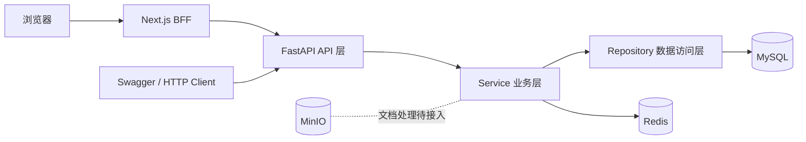
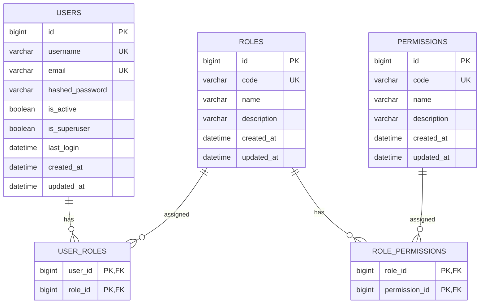
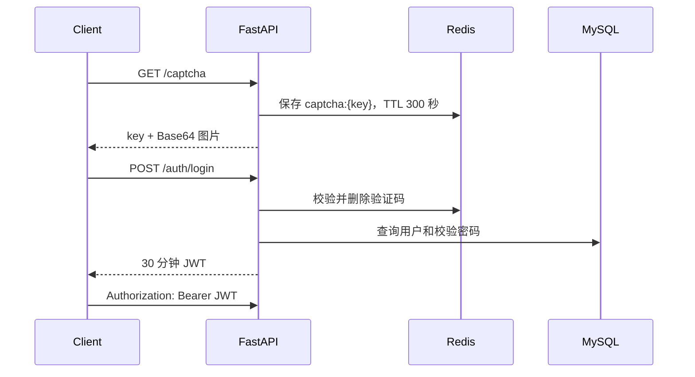

# Leo Agent Platform 项目说明书

> 面向 Codex Sol 的项目接手文档
>
> 最后核对日期：2026-07-29
>
> 本文描述项目约束和演进背景；最新交付状态以 [`IMPLEMENTATION_SUMMARY.md`](IMPLEMENTATION_SUMMARY.md) 为准。

## 1. 文档用途

本文用于让首次接触仓库的开发者或 Codex Sol 快速建立完整上下文，并在不破坏既有实现的前提下继续开发。

开始修改前，应先理解以下三点：

1. 当前仓库具备可运行的 FastAPI 后端、MySQL/Redis 基础设施、认证、RBAC、Provider、Model、Prompt 和知识库基础模块。
2. 根目录下的 `../app` 是已经初始化并完成主要管理页面联调的 Next.js 16 管理端。
3. 前端使用 Next.js App Router、TypeScript、shadcn/ui、Zustand、TanStack Query、React Hook Form 和 Zod。

本文是完整的工程说明；根目录 `../README.md` 仍作为简短的启动和使用入口。

## 2. 项目定位

Leo Agent Platform 的长期目标是提供一个智能体平台，逐步支持：

- 用户、角色和权限管理；
- 登录认证和后台管理；
- 智能体配置与运行；
- 知识库；
- 工具管理；
- 任务编排；
- 对象存储和运行记录。

当前已完成平台基础后端、RBAC、Provider、Model、Prompt 版本管理、Tool 全栈管理、知识库后端基础以及主要管理端页面。智能体运行、任务编排和真实 MinIO 文档处理仍未实现。

## 3. 当前状态总览

| 领域 | 状态 | 说明 |
| --- | --- | --- |
| FastAPI 应用 | 已实现 | 入口为 `../src/main.py`，统一挂载在 `/api/v1` |
| 用户模块 | 基础能力已实现 | 创建、分页搜索、详情、当前用户、分配角色 |
| 图片验证码 | 已实现 | Base64 图片，Redis 保存 5 分钟，一次性消费 |
| 登录认证 | 已实现 | 用户名、密码、验证码登录，签发 30 分钟 JWT |
| 角色模块 | 基础能力已实现 | CRUD、分页搜索、分配权限 |
| 权限模块 | 基础能力已实现 | CRUD、分页搜索 |
| 权限缓存 | 已实现 | Redis Set 缓存用户权限和角色，TTL 30 分钟 |
| Provider | 已实现 | CRUD、API Key 加密、脱敏响应和真实连接测试 |
| Model | 已实现 | CRUD、Provider 外键关系和按 Provider 筛选 |
| Prompt | 已实现 | Draft、发布、版本快照、历史列表和回滚 |
| Tool | 前后端已实现 | CRUD、鉴权、启用/禁用/error 状态机、JSON 配置和 HTTP API 真实测试 |
| Knowledge Base | 后端基础已实现 | CRUD、文档元数据和分段管理；真实 MinIO 处理与前端待实现 |
| 数据库迁移 | 已实现 | Alembic 单线迁移，当前 head 为 `ad7bfa59fd52` |
| 自动化测试 | 已实现 | 后端与前端测试数量以实际测试命令输出为准 |
| Docker 基础设施 | 已实现 | MySQL、Redis、MinIO |
| 前端 | 已实现主要页面 | 登录、工作台、用户、角色、权限、Provider、Model、Prompt、Tool |
| 接口级权限保护 | 未完成 | 权限依赖已经存在，但管理接口尚未普遍接入 |
| MinIO 业务代码 | 未完成 | 已有知识库文档元数据入口，真实上传仍是占位实现 |
| 智能体业务 | 未实现 | 尚无对应模块 |
| CI/CD | 未实现 | 仓库中没有现成流水线 |

## 4. 技术栈

### 4.1 当前后端

| 类别 | 技术 |
| --- | --- |
| 语言 | Python 3.13 |
| Web | FastAPI 0.135.1、Uvicorn 0.51.0 |
| 数据契约 | Pydantic 2.13.4、pydantic-settings 2.14.2 |
| ORM | SQLAlchemy 2.0.48 异步模式 |
| MySQL 驱动 | asyncmy 0.2.11 |
| 数据迁移 | Alembic 1.18.5 |
| 缓存 | Redis 8.0.1 Python 客户端 |
| 认证 | PyJWT 2.13.0、bcrypt 5.0.0 |
| 验证码 | captcha 0.7.1、Pillow |
| 日志 | Loguru |
| 测试 | pytest、pytest-asyncio、httpx |
| 本地基础设施 | MySQL 8.4、Redis、MinIO |

后端依赖以根目录 `../requirements.txt` 为准。项目当前没有 `pyproject.toml`。

### 4.2 当前前端

| 类别 | 选型 | 约束 |
| --- | --- | --- |
| 框架 | Next.js App Router | 默认使用 React Server Components |
| 语言 | TypeScript | 必须开启 strict，不使用无理由的 `any` |
| UI | shadcn/ui + Tailwind CSS | 组件源码进入仓库，可按项目需要修改 |
| 服务端状态 | TanStack Query | 本文中的 “TanStack” 默认指 TanStack Query |
| 客户端状态 | Zustand | 只保存 UI/交互状态，不复制服务端实体缓存 |
| 运行时校验 | Zod | 表单、环境变量和外部 API 响应都在边界校验 |
| 表单 | React Hook Form | 建议与 Zod resolver 配套使用 |
| 包管理器 | pnpm | 初始化后只保留并提交 `pnpm-lock.yaml` |

具体版本由 `package.json` 和 `pnpm-lock.yaml` 固化。不要在同一前端目录混用 npm、pnpm、yarn 或 Bun。

## 5. 仓库结构

当前源码结构如下：

```text
leo-agent-platform/
├── alembic/
│   ├── env.py
│   └── versions/                 # 数据库迁移
├── app/                          # Next.js 16 管理端
├── docs/                         # 规格、实现总结与 OpenAPI 快照
├── docker/
│   ├── docker-compose.yaml       # MySQL、Redis、MinIO
│   ├── .env.example
│   ├── mysql/data/               # 本地运行数据，不是源码
│   ├── redis_data/               # 本地运行数据，不是源码
│   └── minio_data/               # 本地运行数据，不是源码
├── src/
│   ├── core/                     # 配置、依赖、基础模型、响应和异常
│   ├── infra/                    # 数据库与 Redis 连接
│   ├── middlewares/              # HTTP 日志中间件
│   ├── modules/
│   │   ├── auth/
│   │   ├── captcha/
│   │   ├── KnowledgeBase/
│   │   ├── model/
│   │   ├── permission/
│   │   ├── prompt/
│   │   ├── provider/
│   │   ├── role/
│   │   └── user/
│   ├── utils/                    # JWT、密码、权限缓存工具
│   └── main.py                   # FastAPI 应用入口
├── test/                         # 后端自动化测试
├── .env.example
├── README.md
├── docs/PROJECT_SPEC.md          # 本文
├── alembic.ini
├── pytest.ini
├── requirements.txt
└── test_api.http
```

`docker/*/data`、`../../logs`、`../.env` 等本地数据已经由 `../.gitignore` 排除。阅读仓库时不要把 Docker 运行数据当成项目源代码，也不要修改或提交这些目录。

## 6. 当前系统架构



后端按业务模块分层：

| 层 | 文件 | 职责 |
| --- | --- | --- |
| API | `src/modules/*/api.py` | 路由、参数、依赖和响应模型 |
| Schema | `src/modules/*/schema.py` | Pydantic 请求/响应 DTO |
| Service | `src/modules/*/service.py` | 业务校验、流程编排、缓存失效 |
| Repository | `src/modules/*/repository.py` | SQLAlchemy 查询和持久化 |
| Model | `src/modules/*/model.py` | 表、字段和 ORM 关系 |
| Core | `../src/core` | 通用配置、依赖、响应、异常和基类 |
| Infra | `../src/infra` | 数据库 Session 和 Redis 客户端 |

必须遵守的边界：

- API 层保持轻量，不直接拼 SQL，不承载复杂业务流程。
- Service 负责业务规则、跨 Repository 编排和缓存失效。
- Repository 只负责数据访问。
- Schema 与 ORM Model 分离，不把 ORM 对象直接当作稳定的外部契约。
- 数据库和 Redis I/O 使用异步调用。
- 新增或改变表结构必须通过 Alembic migration。
- 当前 `get_db()` 在请求成功后统一 commit，异常时 rollback；普通 Repository 方法以 `flush` 为主，不应自行 commit。

## 7. 数据模型

所有主表继承 `BaseModel`，默认包含：

- `id`: BigInteger 主键；
- `created_at`: 数据库生成的创建时间；
- `updated_at`: 数据库生成并在更新时维护的更新时间。



关键规则：

- `username` 和 `email` 唯一。
- `Role.code` 和 `Permission.code` 唯一。
- 用户与角色、角色与权限都是多对多。
- `is_superuser=True` 的用户在权限集合中得到通配符 `*`。
- 权限 code 应被前端视为不透明字符串。当前注释示例使用 `user:list`，历史数据也可能使用 `user.create`；继续扩展前应统一命名格式。

## 8. 通用 API 契约

### 8.1 成功响应

大多数业务接口使用：

```json
{
  "code": 200,
  "message": "success",
  "data": {}
}
```

对应后端类型为：

```python
class ResponseSchema(BaseModel, Generic[T]):
    code: int = 200
    message: str = "success"
    data: T | None = None
```

### 8.2 分页响应

分页查询参数：

| 参数 | 默认值 | 约束 | 含义 |
| --- | --- | --- | --- |
| `page` | `1` | `>= 1` | 页码 |
| `page_size` | `10` | `1..100` | 每页数量 |
| `keyword` | `null` | 字符串 | 模糊搜索词 |

分页数据结构：

```json
{
  "items": [],
  "total": 0,
  "page": 1,
  "page_size": 10
}
```

搜索字段：

| Repository | 搜索字段 |
| --- | --- |
| `UserRepository` | `username`, `email` |
| `RoleRepository` | `code`, `name` |
| `PermissionRepository` | `code`, `name` |

当前模糊搜索使用 SQL `LIKE %keyword%`，多个字段之间使用 OR，结果按 `id DESC` 排序。

### 8.3 错误响应的当前行为

当前错误契约并不完全统一，前端必须显式处理：

1. `BizException` 返回 HTTP 200，但 body 中的 `code` 可能为 400、401、403 或 404。
2. 未处理异常返回 HTTP 500 和统一 body：

   ```json
   {
     "code": 500,
     "message": "服务器内部错误",
     "data": null
   }
   ```

3. FastAPI/Pydantic 请求校验错误仍使用原生 HTTP 422 `detail` 数组。
4. 因此前端不能只依赖 `response.ok`，还必须解析 body 并检查业务 `code`。

目标上应尽早统一 HTTP 状态码和错误结构。在统一完成前，前端 API Client 要兼容上述现实，不能在各页面重复判断。

## 9. 当前接口清单

后端地址默认是 `http://127.0.0.1:8000`。

### 9.1 系统和验证码

| 方法 | 路径 | 认证 | 请求 | 响应 data |
| --- | --- | --- | --- | --- |
| GET | `/health` | 否 | 无 | 原生 `{"status":"ok"}` |
| GET | `/api/v1/captcha` | 否 | 无 | `{key, image}` |
| POST | `/api/v1/captcha/verify` | 否 | `{key, code}` | `null` |

`image` 是 `data:image/png;base64,...`，可直接作为图片 `src`。验证码长度为 4，有效期 300 秒，成功验证后立即删除。

### 9.2 认证

| 方法 | 路径 | 认证 | 请求 | 响应 data |
| --- | --- | --- | --- | --- |
| POST | `/api/v1/auth/login` | 否 | `LoginRequest` | `{access_token, token_type}` |
| GET | `/api/v1/auth/access` | Bearer | 无 | `{permissions: string[], roles: string[]}` |
| POST | `/api/v1/auth/logout` | Bearer | 无 | `null` |

登录请求：

```json
{
  "username": "test",
  "password": "123456",
  "captcha_key": "<captcha-key>",
  "captcha_code": "<captcha-code>"
}
```

JWT 当前包含 `sub`、`username`、`iat` 和 `exp`，有效期 30 分钟。当前没有 refresh token。

“登出”只清除权限缓存，并不会让已签发的 JWT 立即失效；前端必须同时删除自己的 Token Cookie。

### 9.3 用户

| 方法 | 路径 | 当前认证状态 | 请求/查询 | 响应 data |
| --- | --- | --- | --- | --- |
| POST | `/api/v1/users` | 未保护 | `UserCreate` | `UserRead` |
| GET | `/api/v1/users/me` | Bearer | 无 | `UserRead` |
| GET | `/api/v1/users` | 未保护 | 分页参数 | `PageResult<UserRead>` |
| GET | `/api/v1/users/{user_id}` | 未保护 | path ID | 声明为 `UserWithRolesRead` |
| PUT | `/api/v1/users/{user_id}/roles` | 未保护 | `{role_ids: number[]}` | `UserRead` |
| GET | `/api/v1/users/{user_id}/roles` | 未保护 | path ID | 当前返回单元素用户数组 |

类型：

```text
UserCreate       = username + email + password
UserRead         = id + username + email + is_active
UserWithRolesRead = UserRead + roles[]
```

已知契约问题：

- 用户详情接口声明包含角色，实际代码先转换成 `UserRead`，返回的角色信息不可靠。
- “查看用户角色列表”当前实际返回 `[UserWithRolesRead]`，不是直观的 `RoleRead[]`。
- 前端实现对应页面前，应先修正并测试这两个后端契约。

### 9.4 角色

| 方法 | 路径 | 当前认证状态 | 请求/查询 | 响应 data |
| --- | --- | --- | --- | --- |
| POST | `/api/v1/roles` | 未保护 | `RoleCreate` | `RoleRead` |
| GET | `/api/v1/roles` | 未保护 | 分页参数 | `PageResult<RoleRead>` |
| GET | `/api/v1/roles/{role_id}` | 未保护 | path ID | `RoleRead` |
| PUT | `/api/v1/roles/{role_id}` | 未保护 | `RoleUpdate` | `RoleRead` |
| DELETE | `/api/v1/roles/{role_id}` | 未保护 | path ID | `null` |
| PUT | `/api/v1/roles/{role_id}/permissions` | 未保护 | `{permission_ids: number[]}` | `RoleRead` |

`RoleCreate` 包含 `code`、`name`、可选 `description`；更新时不能修改 `code`。`RoleRead` 包含权限数组。

### 9.5 权限

| 方法 | 路径 | 当前认证状态 | 请求/查询 | 响应 data |
| --- | --- | --- | --- | --- |
| GET | `/api/v1/permissions/` | 未保护 | 分页参数 | `PageResult<PermissionRead>` |
| POST | `/api/v1/permissions/` | 未保护 | `PermissionCreate` | `PermissionRead` |
| GET | `/api/v1/permissions/{permission_id}` | 未保护 | path ID | `PermissionRead` |
| PUT | `/api/v1/permissions/{permission_id}` | 未保护 | `PermissionUpdate` | `PermissionRead` |
| DELETE | `/api/v1/permissions/{permission_id}` | 未保护 | path ID | `null` |

列表和创建路径当前带尾部 `/`，前端端点常量应使用精确路径，避免依赖自动重定向。权限更新不能修改 `code`。

## 10. 认证和 RBAC

### 10.1 当前认证流程



固定路由 `/users/me` 必须继续定义在 `/users/{user_id}` 之前，否则字符串 `me` 会被当作整数 ID 解析。

### 10.2 权限依赖

`../src/core/deps.py` 已提供：

```python
Depends(require_permission("permission.code"))
Depends(require_role("role_code"))
```

但管理接口目前没有普遍使用这些依赖。前端隐藏按钮只改善体验，不构成安全边界；最终授权必须由 FastAPI 在服务端强制执行。

### 10.3 Redis 权限缓存

缓存使用两个 Redis Set：

| Key | 内容 | TTL |
| --- | --- | --- |
| `user:perms:{user_id}` | 用户全部权限 code | 1800 秒 |
| `user:roles:{user_id}` | 用户全部角色 code | 1800 秒 |

行为：

- 首次读取缓存未命中时，从 MySQL 查询并在一个 Redis 事务中同时写入两个 Set。
- 后续权限判断使用 `SISMEMBER`。
- 空集合用内部成员 `__empty__` 表示，避免空缓存与未命中混淆。
- 超级管理员的权限集合包含 `*`。
- 遇到旧的非 Set 类型缓存时会删除旧 Key 并回源数据库。

当前失效时机：

- 给用户重新分配角色；
- 给角色重新分配权限；
- 用户登出。

仍需补齐的失效场景：

- 删除角色后，清除所有受影响用户的角色和权限缓存；
- 删除会影响授权结果的权限后，清除所有受影响用户的缓存；
- 未来禁用用户、改变超级管理员状态时清除缓存。

验证缓存时，可连续访问 `/api/v1/auth/access` 并观察日志：

1. 第一次应记录“权限缓存未命中”，并查询数据库。
2. 第二次应记录“权限缓存命中”，不再查询角色和权限。
3. 给用户重新分配角色后再次访问，应重新回源数据库。

## 11. 后端本地启动

所有后端命令都从仓库根目录执行。配置文件按相对路径读取，从错误目录启动会导致 `../.env` 未加载。

### 11.1 Python 环境

```bash
cd /Users/leo/leo-agent-app/leo-agent-platform
conda create -n leo python=3.13
conda activate leo
python -m pip install -r requirements.txt
```

已有环境时只需激活和同步依赖。

### 11.2 配置

```bash
cp .env.example .env
cp docker/.env.example docker/.env
```

应用 `../.env` 实际需要：

```dotenv
APP_NAME=Leo Agent Platform
APP_ENV=development
APP_DEBUG=true

DB_HOST=127.0.0.1
DB_PORT=3306
DB_USER=root
DB_PASSWORD=<与 MYSQL_ROOT_PASSWORD 相同>
DB_NAME=leo

REDIS_HOST=127.0.0.1
REDIS_PORT=6379
REDIS_PASSWORD=<与 Docker REDIS_PASSWORD 相同>
REDIS_DB=0

LOG_LEVEL=DEBUG
LOG_DIR=logs
```

当前根目录 `../.env.example` 缺少 Redis 配置，这是文档记录的待修项。真实 `../.env` 和 Token 不能提交。

配置优先级：

```text
系统环境变量 > 根目录 .env > Settings 默认值
```

如果 MySQL 报 `using password: NO`，优先检查：

- Working directory 是否为仓库根目录；
- `../.env` 是否存在；
- PyCharm 是否注入了空的 `DB_PASSWORD=`；
- 应用密码和 Docker MySQL 密码是否一致；
- 修改 `../.env` 后是否重启了进程。

### 11.3 基础设施

```bash
docker compose \
  --env-file docker/.env \
  -f docker/docker-compose.yaml \
  up -d
```

默认端口：

| 服务 | 地址 |
| --- | --- |
| MySQL | `127.0.0.1:3306` |
| Redis | `127.0.0.1:6379` |
| MinIO API | `http://127.0.0.1:9000` |
| MinIO Console | `http://127.0.0.1:9001` |

### 11.4 数据库迁移

```bash
alembic upgrade head
alembic current
alembic heads
```

修改 Model 后：

```bash
alembic revision --autogenerate -m "describe_change"
alembic upgrade head
```

自动生成的迁移必须人工检查。新 Model 还要保证 Alembic `env.py` 能导入到对应 metadata。

当前迁移链：

```text
e47d49fe2ebb
  -> 9b76f32461ca
  -> 762c890935b9
  -> a681d0e025ed
  -> da386ce8f72f
  -> e89fbc237aa5
  -> 317f0aac2bbd
  -> 13c44317d33e
  -> 4b19b24825b3
  -> 6d595efa2a58
  -> 8f2c4e1a9b7d
  -> 7a9cfbe79ed3
  -> ad7bfa59fd52
```

新环境迁移后不会自动创建初始管理员、角色或权限，因为仓库尚无 seed/bootstrap 机制。

### 11.5 启动 FastAPI

```bash
python -m uvicorn src.main:app \
  --reload \
  --host 127.0.0.1 \
  --port 8000
```

开发入口：

- 健康检查：`http://127.0.0.1:8000/health`
- Swagger：`http://127.0.0.1:8000/docs`
- ReDoc：`http://127.0.0.1:8000/redoc`
- OpenAPI：`http://127.0.0.1:8000/openapi.json`

### 11.6 PyCharm

Python Run Configuration：

| 配置项 | 值 |
| --- | --- |
| Module name | `uvicorn` |
| Parameters | `src.main:app --reload --host 127.0.0.1 --port 8000` |
| Interpreter | `/opt/miniconda3/envs/leo/bin/python` |
| Working directory | `$PROJECT_DIR$` |
| Environment variables | 通常留空，让应用读取根目录 `../.env` |

## 12. 前端目标架构

### 12.1 核心原则

1. 使用 Next.js App Router，不引入 Pages Router。
2. 页面和布局默认是 Server Component；只有需要浏览器事件、Hook 或 Context 的最小边界才添加 `"use client"`。
3. TanStack Query 管理后端远程数据和请求生命周期。
4. Zustand 只管理共享客户端状态，不保存用户、角色、权限列表等远程实体副本。
5. 分页、关键词、排序和筛选优先放在 URL Search Params，使页面可刷新、可分享、可回退。
6. Zod 是所有不可信输入的运行时边界，包括表单、环境变量、Cookie 派生值和后端响应。
7. JWT 不写入 `localStorage` 或可由客户端 JavaScript 读取的 Zustand store。
8. shadcn/ui 组件放在 `components/ui`，业务组件不直接堆进该目录。
9. 前端展示权限不能代替后端授权。
10. 先完成用户、角色、权限和登录后台，再扩展尚无后端支持的智能体页面。

### 12.2 目标目录

初始化完成后的目标结构：

```text
app/
├── package.json
├── pnpm-lock.yaml
├── next.config.ts
├── components.json
├── public/
└── src/
    ├── app/
    │   ├── (auth)/
    │   │   └── login/
    │   │       └── page.tsx
    │   ├── (dashboard)/
    │   │   ├── layout.tsx
    │   │   ├── page.tsx
    │   │   ├── users/
    │   │   ├── roles/
    │   │   └── permissions/
    │   ├── api/
    │   │   ├── auth/
    │   │   │   ├── login/route.ts
    │   │   │   └── logout/route.ts
    │   │   └── backend/
    │   │       └── [...path]/route.ts
    │   ├── error.tsx
    │   ├── globals.css
    │   ├── layout.tsx
    │   ├── loading.tsx
    │   ├── not-found.tsx
    │   └── providers.tsx
    ├── components/
    │   ├── ui/                   # shadcn/ui 生成的基础组件
    │   ├── layout/               # Header、Sidebar、Shell
    │   └── shared/               # 通用业务无关组件
    ├── features/
    │   ├── auth/
    │   ├── users/
    │   ├── roles/
    │   └── permissions/
    ├── lib/
    │   ├── api/
    │   │   ├── client.ts         # 浏览器调用同源 Next API
    │   │   ├── server.ts         # Server Component/BFF 调用后端
    │   │   ├── endpoints.ts
    │   │   └── response.ts
    │   ├── env.ts
    │   ├── query-client.ts
    │   └── utils.ts
    ├── providers/
    │   └── query-provider.tsx
    ├── stores/
    │   └── ui-store.ts
    ├── types/
    └── proxy.ts                  # 仅做轻量、乐观的路由会话检查
```

根目录已经叫 `../app`，而 Next.js App Router 会位于 `app/src/app/`。两者不是重复目录：

- 第一个 `../app` 是仓库中的前端项目根；
- 第二个 `src/app/` 是 Next.js 的路由目录。

### 12.3 Feature 目录约定

每个业务 Feature 可按需包含：

```text
features/users/
├── api.ts
├── schemas.ts
├── query-options.ts
├── mutations.ts
├── components/
└── index.ts
```

职责：

- `schemas.ts`: Zod Schema，并通过 `z.infer` 导出类型；
- `api.ts`: 纯请求函数，不含 React Hook；
- `query-options.ts`: Query Key 和 Query Options 工厂；
- `mutations.ts`: Mutation Hook 和精确的缓存失效；
- `components/`: 只属于该 Feature 的 UI。

不要手写一份 TypeScript interface，再写一份内容相同的 Zod Schema。能从 Zod 推导的类型应使用 `z.infer`。

## 13. 前端状态归属

| 数据 | 唯一归属 |
| --- | --- |
| 用户、角色、权限、当前用户 | TanStack Query |
| 当前用户 permissions/roles | TanStack Query |
| 请求 loading/error/retry | TanStack Query |
| 分页、keyword、排序、筛选 | URL Search Params |
| Sidebar 开关、主题、纯 UI 偏好 | Zustand |
| 单个弹窗开关、临时输入 | 组件本地 state |
| 登录 JWT | 服务端 HttpOnly Cookie |
| 表单值和错误 | React Hook Form + Zod |

Zustand 的 Next.js 约束：

- 不创建跨请求共享的服务端全局 store。
- React Server Component 不读取或写入 Zustand。
- 需要 SSR 初始值时，使用 store factory 和 Provider，让服务端与客户端初始化数据一致。
- 不把 TanStack Query 的实体复制到 Zustand；否则会产生双缓存和失效问题。

## 14. 前端认证方案

### 14.1 采用 Next.js BFF

当前 FastAPI 返回 Bearer Token JSON，并期待 `Authorization: Bearer ...`。目标前端通过 Next.js Route Handler 建立一层同源 BFF：

```mermaid
sequenceDiagram
    participant Browser
    participant Next as Next.js Route Handler
    participant API as FastAPI

    Browser->>Next: POST /api/auth/login
    Next->>API: POST /api/v1/auth/login
    API-->>Next: access_token
    Next-->>Browser: Set-Cookie: leo_access_token=...; HttpOnly

    Browser->>Next: GET /api/backend/api/v1/users/me
    Next->>Next: 读取 HttpOnly Cookie
    Next->>API: Authorization: Bearer token
    API-->>Next: 统一响应
    Next-->>Browser: 统一响应
```

Cookie 目标配置：

```text
name: leo_access_token
httpOnly: true
secure: production 环境为 true
sameSite: lax
path: /
maxAge: 1800
```

这样做的原因：

- 浏览器 JavaScript 不能直接读取 Token；
- 浏览器只访问同源 Next.js API；
- Next.js 服务端统一附加 Authorization Header；
- 当前 FastAPI 没有配置 CORS，也不会阻塞同源 BFF 方案；
- 后端地址只需要存在服务端环境变量中。

不要在 `NEXT_PUBLIC_*`、Zustand、TanStack Query Cache 或日志中保存 Token。

### 14.2 登录

1. 浏览器先经 BFF 获取验证码。
2. 登录表单用 Zod 校验用户名、密码、验证码字段。
3. Next Route Handler 再次用 Zod 校验请求体。
4. Route Handler 调用 FastAPI 登录接口。
5. 只有 FastAPI body 的业务 `code === 200` 且 Token Schema 校验成功时才写 Cookie。
6. 登录成功后预取 `/users/me` 和 `/auth/access`，再进入后台。

### 14.3 登出

1. Next Route Handler 读取 Token，并调用 FastAPI `/auth/logout` 清理权限缓存。
2. 无论后端清理结果如何，都删除前端 HttpOnly Cookie。
3. 清空当前浏览器的 Query Cache 并跳转登录页。

### 14.4 路由和按钮授权

- `proxy.ts` 只能根据 Cookie 是否存在进行乐观跳转，不执行数据库查询。
- Server Component 或 BFF 在敏感页面加载时应验证会话。
- 前端使用 `/auth/access` 控制菜单和按钮可见性。
- FastAPI 必须使用 `require_permission` 或 `require_role` 进行最终授权。

## 15. 前端 API Client 设计

### 15.1 Zod 响应边界

应先定义通用 Schema：

```ts
import { z } from "zod"

export const apiResponseSchema = <T extends z.ZodType>(data: T) =>
  z.object({
    code: z.number(),
    message: z.string(),
    data: data.nullable(),
  })

export const pageResultSchema = <T extends z.ZodType>(item: T) =>
  z.object({
    items: z.array(item),
    total: z.number().int().nonnegative(),
    page: z.number().int().positive(),
    page_size: z.number().int().positive(),
  })
```

处理流程：

1. 检查网络和 HTTP 状态；
2. 安全读取 JSON；
3. 用对应 Zod Schema 解析；
4. 如果业务 `code !== 200`，抛出统一 `ApiError`；
5. 如果是 HTTP 422，解析 FastAPI `detail`；
6. Schema 不匹配时记录安全的诊断信息，不记录 Token、密码或完整敏感响应。

后端当前个别异常构造存在把字符串误传给 `code` 的问题。前端应该把这种响应识别为契约错误，后端则应优先修复，而不是长期放宽通用 Schema。

### 15.2 请求和缓存

- 管理后台数据频繁变化，默认不要依赖 Next.js 隐式持久缓存。
- TanStack Query 的 `staleTime` 设置为大于 0 的合理值，避免 SSR hydration 后立即重复请求。
- Server Component 预取时使用每个服务端请求独立的 QueryClient。
- 浏览器侧复用单个 QueryClient。
- 需要 SSR/流式加载时使用 `dehydrate` 和 `HydrationBoundary`。

Query Key 必须集中生成并包含所有影响结果的参数，例如：

```ts
export const userKeys = {
  all: ["users"] as const,
  lists: () => [...userKeys.all, "list"] as const,
  list: (params: UserListParams) =>
    [...userKeys.lists(), params] as const,
  details: () => [...userKeys.all, "detail"] as const,
  detail: (id: number) => [...userKeys.details(), id] as const,
}
```

Mutation 成功后的最低失效规则：

| Mutation | 失效或更新 |
| --- | --- |
| 创建/更新/删除用户 | 用户列表；对应用户详情 |
| 给用户分配角色 | 用户详情、用户角色、当前用户 access（若修改自己） |
| 创建/更新/删除角色 | 角色列表；对应角色详情 |
| 给角色分配权限 | 角色详情、受影响 access |
| 创建/更新/删除权限 | 权限列表；对应权限详情；相关角色详情 |

### 15.3 表格分页和搜索

用户、角色和权限列表都使用后端分页：

- URL 示例：`?page=1&page_size=10&keyword=admin`；
- 搜索输入可 debounce，但 URL 是最终真值；
- keyword 变化时 page 重置为 1；
- Query Key 必须包含 page、page_size 和 keyword；
- 后端返回的 `total` 用于分页，不在浏览器全量拉取后再切片。

TanStack Table 可以作为后续可选增强，但不是初始化所需的硬依赖。

## 16. 前端初始化流程

以下命令是目标流程，当前尚未执行。

### 16.1 初始化 Next.js

```bash
cd /Users/leo/leo-agent-app/leo-agent-platform/app
pnpm create next-app@latest . \
  --ts \
  --tailwind \
  --eslint \
  --app \
  --src-dir \
  --import-alias "@/*" \
  --use-pnpm
```

如果 CLI 因版本变化进入交互模式，选择：

- TypeScript: Yes
- ESLint: Yes
- Tailwind CSS: Yes
- `../src` directory: Yes
- App Router: Yes
- import alias: `@/*`

### 16.2 初始化 shadcn/ui 和状态依赖

```bash
pnpm dlx shadcn@latest init
pnpm add zustand @tanstack/react-query zod
pnpm add react-hook-form @hookform/resolvers
pnpm add -D @tanstack/react-query-devtools
```

只添加实际使用的 shadcn/ui 组件，例如：

```bash
pnpm dlx shadcn@latest add \
  button \
  card \
  dialog \
  form \
  input \
  table \
  pagination \
  dropdown-menu \
  alert-dialog \
  sonner
```

不要一次生成所有组件。

### 16.3 前端环境变量

`app/.env.local`：

```dotenv
BACKEND_API_URL=http://127.0.0.1:8000
NEXT_PUBLIC_APP_NAME=Leo Agent Platform
```

约束：

- `BACKEND_API_URL` 只供 Next.js 服务端使用，不加 `NEXT_PUBLIC_`。
- 环境变量通过 Zod 在应用启动边界校验。
- 提交 `app/.env.example`，不提交 `.env.local`。

### 16.4 建议 scripts

```json
{
  "scripts": {
    "dev": "next dev",
    "build": "next build",
    "start": "next start",
    "lint": "eslint .",
    "typecheck": "tsc --noEmit",
    "test": "vitest run"
  }
}
```

开发时：

```bash
cd app
pnpm dev
```

默认访问 `http://localhost:3000`。

## 17. 已实现前端页面

已按以下顺序完成：

1. 全局 Provider、主题和基础布局；
2. 验证码和登录页；
3. BFF、HttpOnly Cookie、当前用户和 access 查询；
4. 后台 Layout、Sidebar 和权限菜单；
5. 用户分页搜索、创建和角色分配；
6. 角色分页搜索、CRUD 和权限分配；
7. 权限分页搜索和 CRUD；
8. 错误页、空状态、Loading Skeleton 和 Toast；
9. 自动化测试、可访问性和生产构建验证。

第一阶段路由：

| 路由 | 功能 |
| --- | --- |
| `/login` | 验证码登录 |
| `/` | 根据会话跳转到登录或后台 |
| `/dashboard` | 后台概览 |
| `/users` | 用户列表、搜索、创建、分配角色 |
| `/roles` | 角色列表、编辑、分配权限 |
| `/permissions` | 权限列表和 CRUD |
| `/providers` | Provider CRUD、连接测试和加密 API Key 输入 |
| `/models` | Model CRUD 和 Provider 筛选 |
| `/prompts` | Prompt CRUD、发布、版本历史和回滚 |
| `/tools` | Tool CRUD、启停状态流转、Function Calling 配置和真实调用测试 |

不要创建 Agent 或 Task 的假数据页面；这些模块目前没有后端契约。Knowledge Base 前端应在真实文件存储流程完成后接入。

## 18. 测试与质量基线

### 18.1 当前后端

当前已验证：

```text
78 passed
```

测试覆盖：

- 密码哈希和校验；
- JWT；
- 验证码服务；
- Repository 搜索；
- 用户、角色、权限分页路由和 Service；
- 当前用户 access 接口；
- 权限/角色缓存命中和未命中；
- 用户角色、角色权限变化后的缓存失效。

提交后端改动前：

```bash
python -m compileall -q src alembic test
python -m pytest -q
git diff --check
```

### 18.2 当前前端

最低测试层级：

- Zod Schema 和 API Client 单元测试；
- Query Key、分页参数和 Mutation 失效测试；
- 登录表单和验证码刷新组件测试；
- 用户、角色、权限关键交互测试；
- Provider、Model、Prompt API 契约测试；
- BFF 登录/登出和 Cookie 行为测试；
- 至少一条登录到后台的浏览器级 smoke test。

提交前端改动前：

```bash
cd app
pnpm lint
pnpm typecheck
pnpm test
pnpm build
```

## 19. 当前已知问题和技术债

### P0：前端管理功能上线前必须解决

1. JWT `SECRET_KEY` 硬编码在 `../src/utils/jwt_utils.py`，必须迁移到环境变量并验证长度。
2. 用户、角色和权限管理接口当前大多未加认证和权限依赖。
3. 用户详情和用户角色接口的响应语义不一致，必须先固定契约。
4. 当前业务异常使用 HTTP 200，应统一 HTTP 状态与错误 Schema，或明确稳定兼容策略。
5. 部分 `RoleService` 代码把错误字符串作为 `BizException` 的第一个位置参数，导致 `code` 类型错误。
6. 删除角色和删除权限时没有完整清理受影响用户的权限缓存。
7. 没有初始超级管理员、角色和权限的安全 bootstrap/seed 流程。
8. 没有 refresh token、Token 吊销或真正的服务端会话；当前 logout 不会撤销 JWT。
9. 登录和验证码接口没有速率限制、失败次数限制或审计机制。

### P1：尽早修正

1. `../.env.example` 缺少 `REDIS_HOST`、`REDIS_PORT`、`REDIS_PASSWORD` 和 `REDIS_DB`。
2. API 路径的尾部斜杠和 summary 命名不一致。
3. `RoleRepository.delete_by_id()` 自行 commit，破坏了请求级事务边界。
4. Schema 缺少更严格的长度、空白、密码复杂度和 code 格式验证。
5. 权限 code 的 `:` 与 `.` 命名风格尚未统一。
6. 缺少 CORS。采用 Next.js BFF 时浏览器不直连 FastAPI，可以暂不开放；若未来直连则必须配置精确 Origin，不能使用宽泛生产配置。
7. Redis Docker 镜像使用 `latest`，可复现部署前应固定版本。
8. 没有统一 lint/format/type-check 配置和 CI。
9. Alembic 的 Model 导入依赖间接导入，新增模块时容易漏表。
10. Knowledge Base 文档上传仍使用路径占位，尚未真正写入 MinIO。

### P2：长期演进

- Agent、Task 等领域模型和 API；
- Tool 的内置工具与自定义函数安全执行器；
- Knowledge Base 的真实文件存储、解析、分段和向量化；
- 审计日志；
- 可观测性和错误追踪；
- OpenAPI 到前端类型/Schema 的受控生成；
- 数据库索引和模糊搜索扩展；
- 生产部署、备份、恢复与密钥管理；
- E2E 和性能测试。

## 20. 修改代码时的标准流程

### 20.1 新增后端模块

1. 明确业务边界和 API 契约。
2. 定义 SQLAlchemy Model。
3. 创建并检查 Alembic migration。
4. 定义 Pydantic Schema。
5. 实现 Repository。
6. 实现 Service 和缓存失效。
7. 实现薄 API 路由。
8. 在 `../src/main.py` 注册 Router。
9. 添加单元测试和路由测试。
10. 更新本文接口和状态说明。

### 20.2 修改角色或权限逻辑

必须回答：

- 哪些用户的最终权限集合会改变？
- 对应的 `user:perms:*` 和 `user:roles:*` 是否同时失效？
- 失败时数据库和缓存是否可能不一致？
- 超级管理员 `*` 是否仍正确？
- 空角色/空权限集合是否仍能被缓存？

### 20.3 新增前端 Feature

1. 先确认后端真实 OpenAPI 和运行时响应，不凭 README 猜字段。
2. 在 Feature 中定义 Zod Schema，并推导 TypeScript 类型。
3. 在 API 层实现纯请求函数。
4. 集中定义 Query Key/Options。
5. 实现页面和业务组件。
6. Mutation 成功后精确失效相关 Query。
7. 添加 loading、empty、error 和 forbidden 状态。
8. 添加测试。
9. 更新本文的页面、接口或已知限制。

### 20.4 数据库变更

- 不直接手工改生产表；
- 不修改已经共享出去的历史 migration 来伪造新历史；
- 新增 migration；
- 检查 upgrade 和 downgrade；
- 同时考虑数据迁移、默认值、非空约束和回滚风险。

## 21. 完成定义

一个功能只有同时满足以下条件才算完成：

- 当前行为与需求一致；
- API、Schema、Service、Repository 边界清晰；
- 权限在后端真正执行；
- 相关缓存正确写入和失效；
- 数据库变化有 Alembic migration；
- 前端不重复保存远程数据；
- 外部输入和响应通过 Zod/Pydantic 校验；
- 正常、空、错误、未登录和无权限状态有明确行为；
- 自动化测试覆盖关键路径；
- 后端测试通过，前端 lint/typecheck/test/build 通过；
- 没有提交 Token、密码、`../.env`、数据库文件或运行日志；
- README 或本文已同步必要的使用和架构变化。

## 22. Codex Sol 接手规则

接手任一开发任务时：

1. 先阅读本文，再读取与任务直接相关的源码和测试。
2. 以当前代码和实际 OpenAPI 为事实来源；本文与代码冲突时，先指出差异，再决定修文档还是修代码。
3. 严格区分“已实现”和“目标设计”，不要为尚不存在的模块编造完成状态。
4. 修改前检查工作区，保留与任务无关的现有改动。
5. 不输出或提交 `../.env`、Token、密码、JWT 密钥、Docker 数据和日志。
6. 后端遵守 API/Service/Repository/Schema/Model 分层。
7. 前端遵守 Server Component 默认、TanStack Query 管远程状态、Zustand 管 UI 状态、Zod 管边界的规则。
8. 不使用 `localStorage` 保存 JWT。
9. 不通过前端隐藏按钮代替后端权限校验。
10. 修改模型时创建 migration；修改授权关系时处理缓存失效。
11. 修复问题时补回归测试，不只修改表面症状。
12. 完成后说明修改文件、验证命令、验证结果和仍存在的风险。

## 23. 官方参考

- [Next.js App Router](https://nextjs.org/docs/app)
- [Next.js 项目结构](https://nextjs.org/docs/app/getting-started/project-structure)
- [Next.js Authentication](https://nextjs.org/docs/app/guides/authentication)
- [Next.js cookies API](https://nextjs.org/docs/app/api-reference/functions/cookies)
- [shadcn/ui Next.js 安装](https://ui.shadcn.com/docs/installation/next)
- [TanStack Query 与 Next.js Server Components](https://tanstack.com/query/latest/docs/framework/react/guides/advanced-ssr)
- [Zustand 的 Next.js 指南](https://zustand.docs.pmnd.rs/learn/guides/nextjs)
- [Zod 官方文档](https://zod.dev/)
